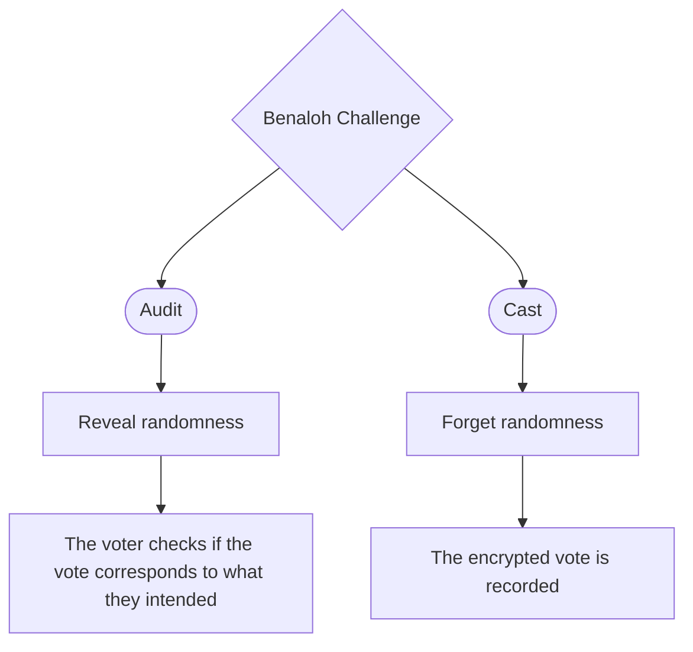

+++
title = 'Another device for sound auditing using the Benaloh Challenge'
date = 2024-10-24T15:17:09+02:00
draft = true
+++

E-voting systems often require this two conflicting properties:
- Cast-as-intended: The voting device should be trusted to accurately cast the voter's intended choice.
- Receipt-freeness: The voting device should forget the randomness used during voting to prevent the voter from proving their vote to a coercer.

The Benaloh Challenge offers a theoretical solution to this problem, allowing voters to either cast a ballot or audit the voting machine.

In theory voters should audit randomly and regularely, ideally by selecting a candidate at random. However, in practice, few voters perform audits, and selecting a unwanted candidate feels counterintuitive. This makes this solution poorly practical.

To address these limitations, we propose a _user-controlled_ audit device that interfaces with the voting device and follows a theoretically sound protocol for auditing.

The protocol could be as followed:
- The **audit device** audit the **voting device** N times (N chosen at random) with random candidates. Every audit should pass.
- The N + 1 time, the voter cast their ballot with the intended candidate.

This would give us a probabilistic proof for cast-as-intended, while receipt-freeness still holds.
