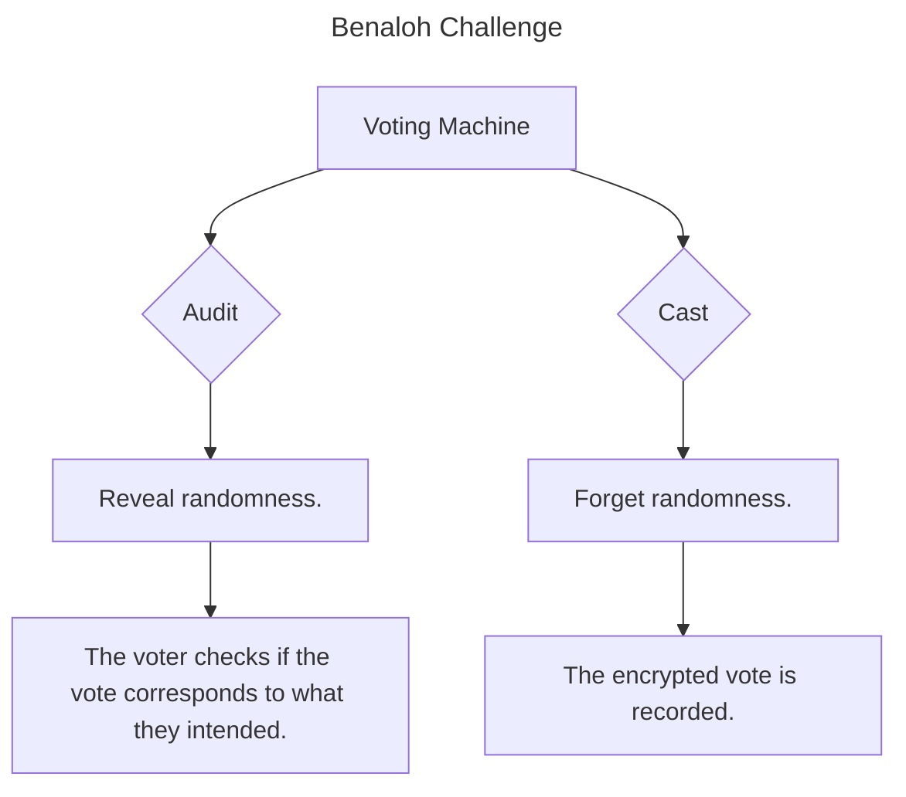

+++
title = 'Automatic Benaloh Challenge'
date = 2024-10-24T15:17:09+02:00
+++

E-voting systems often require this two conflicting properties:
- Cast-as-intended: The voting device should be trusted
- Receipt-freeness: The voting device should forget the randomness used during voting, preventing the voter from proving their vote to a coercer.

The Benaloh Challenge is a theorical solution to this problem where the voter has either the choice to cast a ballot or to audit the voting machine.

In theory voters should audit randomly and regularely. When auditing, they should select a candidate at random. In practice, few voters audit the machine. When auditing, it is very ununtuitive to select another candidate. This makes this solution poorly practical.

We propose the use of a (user\_controlled) **audit device** when voting. The device would interface with the **voting machine** and to follow a theoretically sound protocol for auditing.

The protocol could be as followed:
- The **audit device** would audit the **voting machine** N times (chosen at random) with random candidates. Every audit should pass.
- The N + 1 time, the voter would cast his ballot.

It would give us a probabilistic proof of cast-as-intended, while receipt-freeness still holds.
