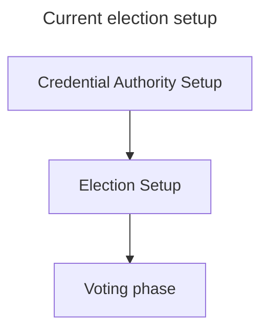
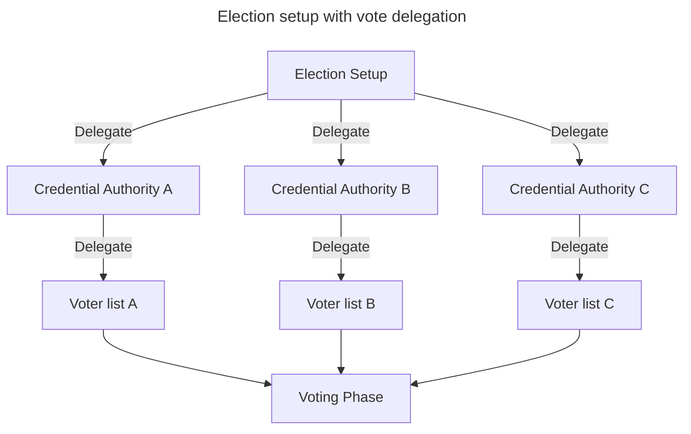

+++
title = 'Eligiblity distribution in Belenios'
date = 2024-10-17T17:09:00+02:00
+++

We discuss a more flexible way to handle credentials, such that we could have elections organized by multiple parties, every party managing his own list of voters.

In Belenios, credentials are generated by the credential authority before the election setup in the following (simplified) process:

- The credential authority (CA) is given a list of emails with corresponding voting weight.
- The CA generate two lists. A list of pair "(email, private\_credentials)" that should be sent to every voter. And a list of anonymised public\_credential associated with the corresponding weight.
- It sends to every voter his private credential
- It sends the list of public credentials to the Election Server (ES)
- It should forget the private credentials



We propose a change that would allow multiple CA to collaborate in the generation of the list of credentials.
It could be for exemple an election organized by multiple small cities. Every town managing his own voting list.



The change is not costly. It could be modeled by a single event new event ('Delegate') that even has extra advantages (vote delegation is now possible).

```js
let currentCredentials = [
    "ElectionCredentialPublicKey,300"
];

// To distribute credentials to many CAs, using the weight mechanism
let event = {
    type: "Delegate",
    source: "ElectionCredentialPublicKey",
    destinations: [
        "CredentialAuthorityAPublicKey,100",
        "CredentialAuthorityBPublicKey,100",
        "CredentialAuthorityCPublicKey,100"
    ],
    signature: "..."
}
```

```js
let currentCredentials = [
    "CredentialAuthorityAPublicKey,100",
    "CredentialAuthorityBPublicKey,100",
    "CredentialAuthorityCPublicKey,100"
];

// To distribute credentials to voter
let event = {
    type: "Delegate",
    source: "CredentialAuthorityAPublicKey",
    destinations: [
        "AlicePublicKey,1",
        "BobPublicKey,1",
        "CredentialAuthorityAPublicKey,98"
    ],
    signature: "..."
}
```

It could also model proxy voting ("procuration" in french)

```js
// To distribute credentials to voter
let event = {
    type: "Delegate",
    source: "AlicePublicKey",
    destinations: [
        "CharlyPublicKey,1"
    ],
    signature: "..."
}
```
