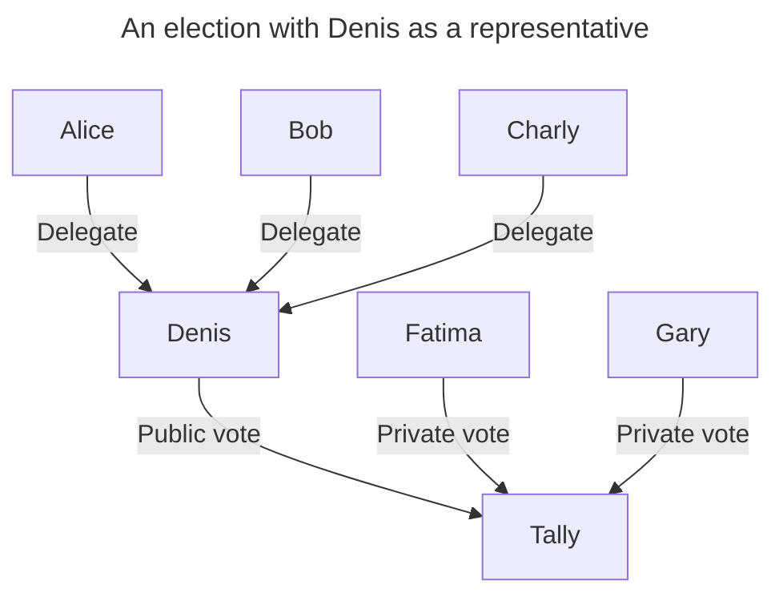
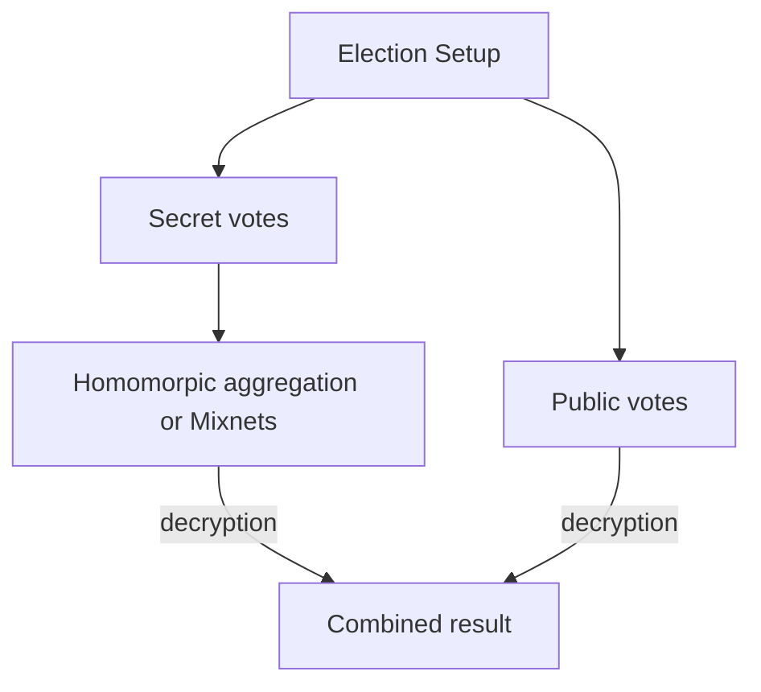

+++
title = 'Mixing secret and public votes'
date = 2024-10-19T19:21:02+02:00
+++

In certain complex voting systems, public voting can be beneficial. However, in most cases, voter secrecy is essential to ensure the integrity and sincerity of the election.

Public voting is important, for example, when collecting votes from representatives, as it ensures accountability for their decisions, given that they are making choices on behalf of many.

In "Liquid Democracy" systems, individuals can either delegate their vote to a representative or vote directly. This flexibility is useful when there are many issues to vote on, and the voter may not have time to consider each one. They can rely on a representative while still retaining the option to vote differently on specific issues where they hold a different view.

Such voting systems would need to model vote delegation and allow both public and secret voting.

Vote delegation can be represented as an edge `(src, dst)` indicating that `src` transfers their voting power to `dst`. This can either allow `dst` to cast an additional vote in behalf of `src`(case of proxy voting), or increase the weight of `dst`'s vote by the weight of `src` (case of representatives).

Mixing public and secret votes means that some votes would be hidden (either through mix-nets or aggregation) while others would not. In the end, both anonymized/hidden votes and public votes are decrypted separately and combined to form the final tally.

