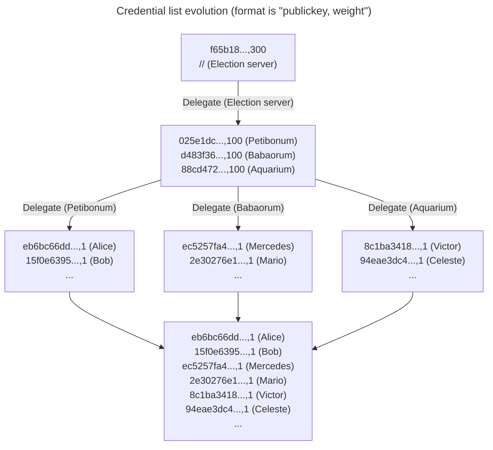
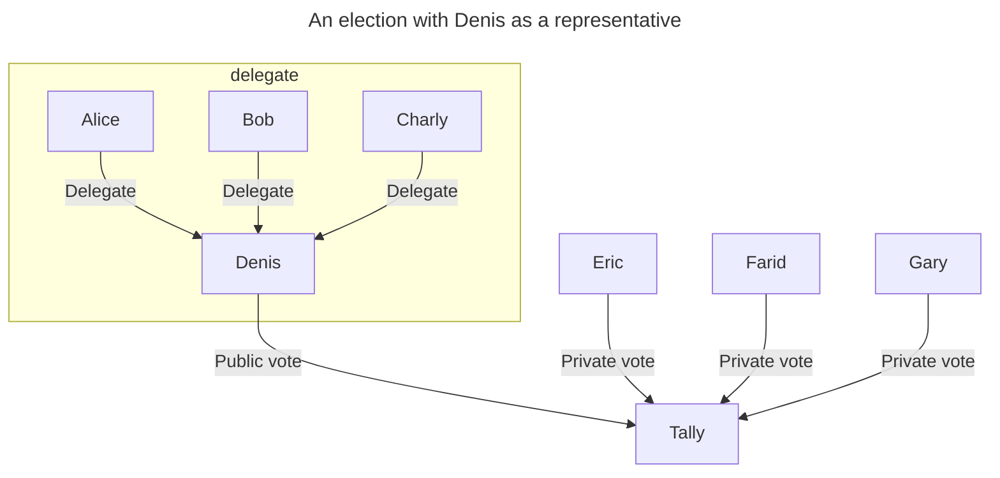

+++
title = 'Usecases of proxy voting in e-voting'
date = 2024-10-17T17:09:00+02:00
+++

# Proxy voting

Proxy voting is a mechanism where a voter can delegate their voting power.

In the case of e-voting systems with verifiable eligibility, the voter list is often in the form of a list of public keys.

In such system, an event `Delegate(Alice,Bob)`, signed by Alice, would means that Alice is giving his voting power to Bob.

*It might sound wrong because it would make vote selling trivial, but it remains a powerful primitive that has interesting use cases.*

# Decentralized voter list management

Instead of one large credential authority (CA),
multiple smaller CAs collaborate to generate the list of credentials.

Here 300 votes are distributed:
- From the election server to 3 "local" credentials authorities
- From each credential authority to voters

It contrasts with Belenios, where the CA acts first, before the election is created.

# Liquid democracy

In liquid democracy voting systems, voters can choose to delegate their vote to the representative of their choice, or vote by themselves.

In this case, it is useful to have public votes, since representatives should be held accountable for their decision, as they decide for many.

However, vote secrecy is still required for individual votes.

# Trusted third party for lost credentials

In this case, a trusted third party, typically a Certificate Authority (CA) could regenerate credentials on behalf of a voter who has lost their public key.

In cases of lost credentials (or even logging with another device) the CA would be able to regenerate new credentials after verifying the user's identity (for example by email and phone).

This process must be done with care, only in rare cases, and warnings should be issued.

Note: In the case of one-out-of-many signatures, it is not possible to remove a credential, but we could rely on revocation certificates that sign delegation to NULL, effectively "burning" a serial.
